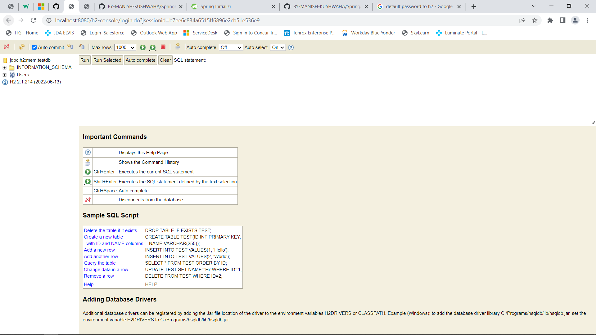

### https://www.tutorialspoint.com/springjdbc/springjdbc_delete_query.htm
```
@Controller => Web Layer

    => Methods => HTTP Requests

    => @RestController

@Service => Service Layer

    > Business Logic

@Repository => Data Access Layer

    => Encapsulate Storage, retrieval, search

I

Employee => Fname, Email, Salary

Average salary => service => average salary => salary

Ecommerce Website

    Users => Component => Aspect Oriented Programming

    Login Service, Signup Service,

    Forgot PasswordService => Business Logic => Filter Service Interface => getRecommendations() => ContentFiltering, MultiFiltering, => Injecting on RecommendedMovielmplementation()

    Email, Password => Data Layer => @Repository => DAO

    Response on Ul/Web =›› @Controller => Web Laver

    Products => Component =› Category Service, Review Service
```
# Try to use In Memory Database (called as mem)

## H2 Console GUI ENABLE
```
    Properties change : 
            spring.datasource.url=jdbc:h2:mem:testdb
            spring.datasource.driver-class-name=org.h2.Driver
            spring.datasource.username=test
            spring.datasource.password=test
            spring.h2.console.enabled=true
            spring.h2.console.settings.web-allow-others=true

    Link: http://http://localhost:8080/h2-console
    
    Note:
        ./currentDirectory ==> Relative Path (fixed for all user) { ../(backward) ./(current folder)}
        C:/.../currentDirectory ==> Absolute Path (Varry from user to user)
```

### AFTER LOGIN


# ADD SCHEMA.SQL (Database Table)
```
Learn RDBMS, SQL-JOINTS
Link: https://livesql.oracle.com/apex/f?p=590:1000

schema.sql
-- CREATING A TABLE
-- CREATE TABLE TABLE_NAME
CREATE TABLE Player(
--  COLUMN_NAME TYPE REQUIRED OR OPTIONAL
    ID INTEGER NOT NULL,
    Name VARCHAR(255) NOT NULL ,
    Age INTEGER NOT NULL,
    Nationality VARCHAR(50) NOT NULL,
    DOB TIMESTAMP,
    Designation INTEGER,
    -- UNIQUE KEY FOR THE TABLE
    PRIMARY KEY (ID)
)

data.sql
INSERT INTO Player VALUES( 1,	'Alice',	22, 'INDIAN', '2000-01-01',	1);
INSERT INTO Player VALUES( 2,	'Manish',	26, 'INDIAN', '2000-01-01',	1);
INSERT INTO Player VALUES( 3,	'Kushwaha',	25, 'INDIAN', '2000-01-01',	1);
INSERT INTO Player VALUES( 4,	'Kush',	24, 'INDIAN', '2000-01-01',	1);

H2-console Query: SELECT * from Player; (Insert Entries)
```


# MYSQL, MSSQL - Theory
(Relational Database Management System)

Tables/Tuples(Rows) in RDBMS and Columns
```
// HOW TO ADD SCHEMA
Make SCHEMA FILE IN RESOURCES


Table:1 (SALARY)
SALARY     ID         LOCATION
23455      123        NY
34567      1234       IN
45678      5678       USA

Table: 2 (PLAYER)
ID         NAME
123        Arjun
1234       Manish
2345       Jaya

2 IDs are common on both Table and ID is our Primary Key
If Salary is Primary Key and ID for another we need to take a Query

Commands:
    SELECT*FROM PLAYERS WHERE SALARY.ID=PLAYER.ID
    Select Name, Age,DOB From Player Where PID = 2;
    
```
 
## Date Type
### ==> INT, VARCHAR, DATE, TIMESTAMP

### ---------------------------------------------------------------------
# JDBC Query

## ROWMAPPER
```

@Repository
public class PlayerDAO {

    @Autowired
    JdbcTemplate jdbcTemplate;

    public List<Player> getAllPlayers(){
        String getPlayerQuery = "SELECT * FROM Player";

        // Row Mapper
        return jdbcTemplate.query(getPlayerQuery,new BeanPropertyRowMapper<Player>(Player.class));
    }
}

@RestController
public class playerController {

    @Autowired
    PlayerDAO dao;

    @GetMapping(value = "/players")
    public List<Player> getAllPlayerFromDB(){
        return dao.getAllPlayers();
    }

    @GetMapping(value = "/players-json", produces = MediaType.APPLICATION_JSON_VALUE)
    public List<Player> getAllPlayerFromDBJson(){
        return getAllPlayerFromDB();
    }

}
```

# DEFINE ALL CLASS IN APPLICATION LAYERING
## WEB LAYER
```
=> CLIENT
=> VIEW
=> CONTROLLER => getPlayerController => Autowired Player DAO
```
## DAO
```
=> PlayerDAO => @Autowired JDBCTemplate
=> Jdbc Template => Querying =>From the Database, Mapping to => Player Model [Encapsulated Data]
```
## DATABASE
```

```

# RECAP
```
Client => Browser => Request => http://localhost:8080/movies => Get request

Request Fulfill By: Tomcat Server => 127.0.0.1:8080 => SpringBootJdbcApplication => Main Class => @SpringBootApplication select this file for Server

SpringBootJDBCApp => @ComponentScan =>PlayerController @RestController[Bean] => Default Constructor => @Autowired PlayerDAO

PlayerDAO.getALLPlayers() =>Communicate with the Database @Autowired JDBC Template => Querying, RowMapping[Player Model] DAO =>
```
## JDBC TEMPLATE


# JPA


```
=> No Row Mapper
=> No Schema.sql

@Repository 

@Entity1 => @ Table => In Database => Hibernate core will drop in the database and create new one => @Column, @Id, => Columns inside our database
@Entity2
@Entity3

How to Apply this on Model class
package com.spring.boot.jdbc.Spring.Boot.JDBC;

import javax.persistence.*;
import java.util.Date;

@Entity             // RowMapping (create database/schema)
@NamedQuery(name = "get-all-players",query = "SELECT p FROM Player p")
@Table(name = "Player") // give the table name
public  class Player {

    @Id
    @GeneratedValue
    private int pid; // Primary Key

    @Column(name = "Name")
    private String name;

    @Column(name = "Age")
    private int age;

    @Column(name = "Nationality")
    private String nationality;

    @Column(name = "DOB")
    private Date dob;

    @Column(name = "Designation")
    private int designation;

    public Player() {
    }

    public Player(int pid, String name, int age, String nationality, Date dob, int designation) {
        this.pid = pid; // id also valid
        this.name = name;
        this.age = age;
        this.nationality = nationality;
        this.dob = dob;
        this.designation = designation;
    }

    // all getter and setter

    @Override
    public String toString() {
        return "Player{" +
                "pid=" + pid +
                ", name='" + name + '\'' +
                ", age=" + age +
                ", nationality='" + nationality + '\'' +
                ", dob=" + dob +
                ", designation=" + designation +
                '}';
    }
}

package com.spring.boot.jdbc.Spring.Boot.JDBC.Repository;


import com.spring.boot.jdbc.Spring.Boot.JDBC.Entity.Player;
import org.springframework.stereotype.Repository;

import javax.persistence.EntityManager;
import javax.persistence.PersistenceContext;
import javax.persistence.TypedQuery;
import javax.transaction.Transactional;
import java.util.List;

// jda - Java persistence api
@Repository // To perform
@Transactional // to make transaction b/w java classes and database
public class PlayerRepository {

    @PersistenceContext
    EntityManager entityManager;


    public Player insertPlayer(Player player){
        return entityManager.merge(player);
    }

    public Player updatePlayer(Player player){
        return entityManager.merge(player);
    }

    public Player getPlayerById(int id){
        return entityManager.find(Player.class,id);
    }

    public void deleteById(int id){
        Player player = getPlayerById(id);
        entityManager.remove(player);
    }

    public List<Player> getAllPlayer(){
        TypedQuery<Player> getAll = entityManager.createNamedQuery("get-all-players", Player.class);

        return getAll.getResultList();

    }

Inside run method(SpringBootJDBCApplication)
@Autowired
PlayerRepository playerRepository;
// CREATE
		String input = args.length == 0 ? "2000-02-11" : args[0];
		SimpleDateFormat ft = new SimpleDateFormat ("yyyy-MM-dd");
		playerRepository.insertPlayer(new Player("Manish Kumar Kushwaha",29,"Ireland",ft.parse(input),8));
			// new Date from SQL
		playerRepository.insertPlayer(new Player("ZAYA",29,"INDIA",Date.valueOf("2000-03-02"),8));
		playerRepository.insertPlayer(new Player("Manish Kumar Kushwaha",29,"Ireland",ft.parse(input),8));

		// READ
		System.out.println("Player By ID:" + playerRepository.getPlayerById(1));

		// Upadte -> Add PID value
		playerRepository.updatePlayer(new Player(2,"Kumar Kushwaha",29,"India",ft.parse(input),8));
		System.out.println("Player By ID AFTER UPDATE:" + playerRepository.getPlayerById(2));

		// Delete
		playerRepository.deleteById(2); // Check this table on H2 console

		// Get All Players
		System.out.println("All Player List:"+playerRepository.getAllPlayer());

}


```

# HTTP => Hyper Text Tranfer Protocol

```
Hypermedia Information, Collaborative Media => TIP Connections by default on PORT 80

Stateless => No Particular Form => HTML, JSON, XML, PDF, PNG, JPEG => Data Exchange Statefull => Restful API => JSON, XML => Proper Form

Stateful => Rest API => Json, XML => Proper Form

URL + HTTP + RestfultAPI

URL: Location your server => 192.168.8.8:8080 => amazon.com

HTTP: TCP by 80 => Stateless => Data Exchange between your server and client

Restful API: Representational state Tranfer => it should make sense

Client     and      Server
BrowserApp <=> Spring Boot App

URL+ HTTP + Restful API[JSON,XML]

----Example----
Whater APP => Client => Request Temperature of Mumbai => Weather Data Its Raining => JSON Data(UI take this data and show as View)

GoogleMaps => Servre => Response Temperature of Mumbai

Response:
    {
        Location:Mumbai,
        Temperature: 80,
        TempUnit: C,
        Prediction: 40,
        PredictUnit: Percentange
    }
    
 REST means we sending some meaningful Data to client.
 
 Request Line: => Contains HTTp Method like(Get, Post, Put, Delete)
 
 Request Header => Data with additional information about the request vou are passina =› Configurations for vour request line
 
 Request Header => contain of the entity player
 
 

```

```
Response Body/Message
    => Status Code of Message => 200

HTTP METHODSs
1. POST => CREATING A RESOURCE => h2Database testdb
2. GET => READING A RESOURCE => h2Database:testdb
3. PUT => UPDATING A RESOURCE => h2Database:testdb
4. DELETE => DELETING A RESOURCE=> h2Database:testdb

```


