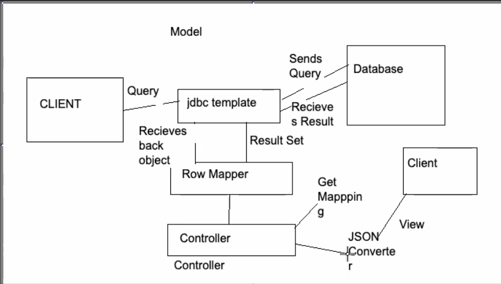

```
@Controller => Web Layer

    => Methods => HTTP Requests

    => @RestController

@Service => Service Layer

    > Business Logic

@Repository => Data Access Layer

    => Encapsulate Storage, retrieval, search

I

Employee => Fname, Email, Salary

Average salary => service => average salary => salary

Ecommerce Website

    Users => Component => Aspect Oriented Programming

    Login Service, Signup Service,

    Forgot PasswordService => Business Logic => Filter Service Interface => getRecommendations() => ContentFiltering, MultiFiltering, => Injecting on RecommendedMovielmplementation()

    Email, Password => Data Layer => @Repository => DAO

    Response on Ul/Web =›› @Controller => Web Laver

    Products => Component =› Category Service, Review Service
```
# Try to use In Memory Database (called as mem)

## H2 Console GUI ENABLE
```
    Properties change : 
            spring.datasource.url=jdbc:h2:mem:testdb
            spring.datasource.driver-class-name=org.h2.Driver
            spring.datasource.username=test
            spring.datasource.password=test
            spring.h2.console.enabled=true
            spring.h2.console.settings.web-allow-others=true

    Link: http://http://localhost:8080/h2-console
    
    Note:
        ./currentDirectory ==> Relative Path (fixed for all user) { ../(backward) ./(current folder)}
        C:/.../currentDirectory ==> Absolute Path (Varry from user to user)
```

### AFTER LOGIN


# ADD SCHEMA.SQL (Database Table)
```
Learn RDBMS, SQL-JOINTS
Link: https://livesql.oracle.com/apex/f?p=590:1000

schema.sql
-- CREATING A TABLE
-- CREATE TABLE TABLE_NAME
CREATE TABLE Player(
--  COLUMN_NAME TYPE REQUIRED OR OPTIONAL
    ID INTEGER NOT NULL,
    Name VARCHAR(255) NOT NULL ,
    Age INTEGER NOT NULL,
    Nationality VARCHAR(50) NOT NULL,
    DOB TIMESTAMP,
    Designation INTEGER,
    -- UNIQUE KEY FOR THE TABLE
    PRIMARY KEY (ID)
)

data.sql
INSERT INTO Player VALUES( 1,	'Alice',	22, 'INDIAN', '2000-01-01',	1);
INSERT INTO Player VALUES( 2,	'Manish',	26, 'INDIAN', '2000-01-01',	1);
INSERT INTO Player VALUES( 3,	'Kushwaha',	25, 'INDIAN', '2000-01-01',	1);
INSERT INTO Player VALUES( 4,	'Kush',	24, 'INDIAN', '2000-01-01',	1);

H2-console Query: SELECT * from Player; (Insert Entries)
```


# MYSQL, MSSQL - Theory
(Relational Database Management System)

Tables/Tuples(Rows) in RDBMS and Columns
```
// HOW TO ADD SCHEMA
Make SCHEMA FILE IN RESOURCES


Table:1 (SALARY)
SALARY     ID         LOCATION
23455      123        NY
34567      1234       IN
45678      5678       USA

Table: 2 (PLAYER)
ID         NAME
123        Arjun
1234       Manish
2345       Jaya

2 IDs are common on both Table and ID is our Primary Key
If Salary is Primary Key and ID for another we need to take a Query

Commands:
    SELECT*FROM PLAYERS WHERE SALARY.ID=PLAYER.ID
    Select Name, Age,DOB From Player Where PID = 2;
    
```
 
## Date Type
### ==> INT, VARCHAR, DATE, TIMESTAMP

### ---------------------------------------------------------------------
# JDBC Query

## ROWMAPPER
```

@Repository
public class PlayerDAO {

    @Autowired
    JdbcTemplate jdbcTemplate;

    public List<Player> getAllPlayers(){
        String getPlayerQuery = "SELECT * FROM Player";

        // Row Mapper
        return jdbcTemplate.query(getPlayerQuery,new BeanPropertyRowMapper<Player>(Player.class));
    }
}

@RestController
public class playerController {

    @Autowired
    PlayerDAO dao;

    @GetMapping(value = "/players")
    public List<Player> getAllPlayerFromDB(){
        return dao.getAllPlayers();
    }

    @GetMapping(value = "/players-json", produces = MediaType.APPLICATION_JSON_VALUE)
    public List<Player> getAllPlayerFromDBJson(){
        return getAllPlayerFromDB();
    }

}
```

# DEFINE ALL CLASS IN APPLICATION LAYERING
## WEB LAYER
```
=> CLIENT
=> VIEW
=> CONTROLLER => getPlayerController => Autowired Player DAO
```
## DAO
```
=> PlayerDAO => @Autowired JDBCTemplate
=> Jdbc Template => Querying =>From the Database, Mapping to => Player Model [Encapsulated Data]
```
## DATABASE
```

```

# RECAP
```
Client => Browser => Request => http://localhost:8080/movies => Get request

Request Fulfill By: Tomcat Server => 127.0.0.1:8080 => SpringBootJdbcApplication => Main Class => @SpringBootApplication select this file for Server

SpringBootJDBCApp => @ComponentScan =>PlayerController @RestController[Bean] => Default Constructor => @Autowired PlayerDAO

PlayerDAO.getALLPlayers() =>Communicate with the Database @Autowired JDBC Template => Querying, RowMapping[Player Model] DAO =>
```
## JDBC TEMPLATE

